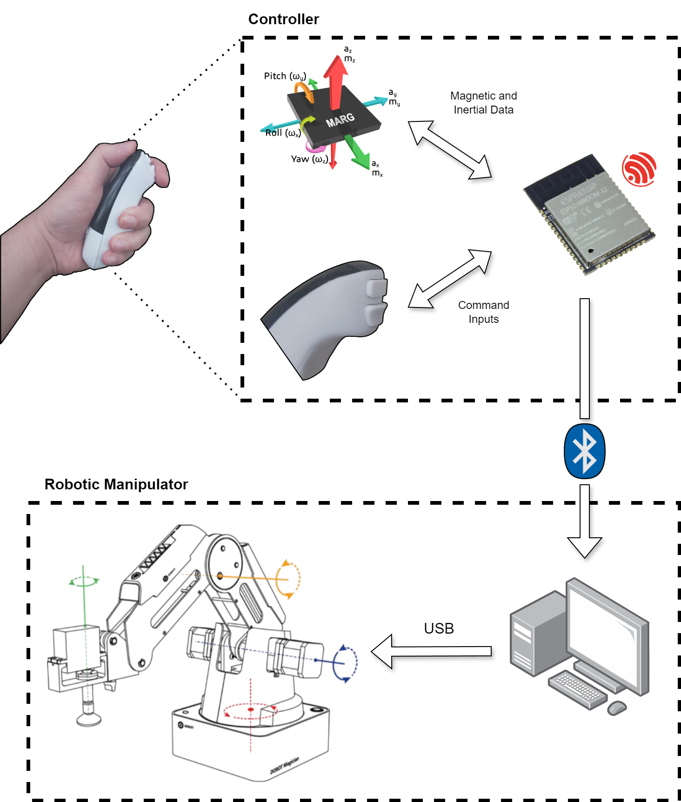

# Robot Manipulator with ESP32 Motion Controller

[](LICENSE)
[](https://www.espressif.com/)
[](https://www.python.org/)

A **real-time gesture-based robotic arm control system** that enables intuitive manipulation of the Dobot Magician robot using IMU (Inertial Measurement Unit) sensor data from an ESP32 motion controller. This project implements advanced sensor fusion, Kalman filtering, and motion translation algorithms to achieve smooth, responsive robot control through natural hand movements.

---

## 📋 Table of Contents

- [Overview](#overview)
- [System Architecture](#system-architecture)
- [Key Features](#key-features)
- [Hardware Requirements](#hardware-requirements)
- [Software Components](#software-components)
- [Installation](#installation)
- [Usage](#usage)
- [Technical Details](#technical-details)
- [Project Structure](#project-structure)
- [Configuration](#configuration)
- [Future Improvements](#future-improvements)
- [Academic Context](#academic-context)
- [License](#license)
- [Author](#author)

---

## 🔍 Overview

This project was developed as a **graduation thesis (TCC)** and demonstrates the integration of embedded systems, sensor fusion algorithms, optimal state estimation, and robotics to create an intuitive human-robot interface. By wearing or holding the ESP32 motion controller, users can control the Dobot Magician robotic arm through natural hand gestures—the robot mimics the user's movements in real-time.

### What Makes This Special?

- **Real-time sensor fusion** using the Madgwick AHRS algorithm for accurate orientation estimation
- **Kalman filtering** for optimal velocity estimation from noisy accelerometer data
- **Gravity compensation** to isolate intentional motion from gravitational acceleration
- **Dominant axis detection** for intuitive single-axis robot movements
- **Low-latency serial communication** between ESP32 and host computer
- **Modular architecture** with clear separation between firmware and control software

---

## 🏗️ System Architecture

The system consists of two main subsystems that communicate via serial interface:



### Data Flow Pipeline

1. **Sensor Acquisition** (ESP32): MPU9250 reads 9-axis data (accel, gyro, mag) at ~100 Hz
2. **Sensor Fusion** (ESP32): Madgwick algorithm computes orientation quaternion
3. **Motion Processing** (ESP32): Gravity vector rotation, compensation, and velocity integration
4. **Serial Transmission** (ESP32→PC): Formatted measurement packets via USB/Bluetooth
5. **Kalman Filtering** (Python): Optimal velocity estimation with noise reduction
6. **Motion Mapping** (Python): IMU data → Dobot jog commands (dominant axis selection)
7. **Robot Execution** (Dobot): Cartesian space jogging with smooth motion profiles

---

## ✨ Key Features

### ESP32 Firmware (C/FreeRTOS)
- **9-DOF IMU Integration**: Full support for MPU9250 (accelerometer, gyroscope, magnetometer)
- **Madgwick AHRS Algorithm**: Advanced sensor fusion for drift-free orientation estimation
- **Gravity Compensation**: Removes gravitational acceleration to isolate user motion
- **Drift Correction**: Moving average filter and bias compensation for velocity estimation
- **Real-time Processing**: ~100 Hz update rate with deterministic timing
- **GPIO Button Support**: Two buttons for gripper control and motion enable/disable
- **Calibration Mode**: Built-in calibration routine for sensor offset and bias correction

### Python Control Software
- **Kalman Filter Implementation**: Discrete-time optimal state estimator for velocity
- **Dominant Axis Detection**: Intelligent selection of motion direction from 3D acceleration
- **Velocity & Acceleration Scaling**: Configurable gain parameters for motion tuning
- **CSV Data Logging**: Automatic recording of all measurements for analysis
- **Multi-communication Support**: USB serial or Bluetooth connectivity
- **Emergency Stop**: Ctrl+C handler for safe return to home position
- **Motion State Tracking**: Prevents redundant command transmission

---

## 🛠️ Hardware Requirements

### Primary Components

| Component | Model | Purpose | Interface |
|-----------|-------|---------|-----------|
| Microcontroller | **ESP32** | Motion controller & IMU interface | USB/Bluetooth |
| IMU Sensor | **MPU9250** | 9-axis motion sensing | I2C (0x68) |
| Robot | **Dobot Magician** | 4-DOF robotic manipulator | Serial (115200) |
| Host Computer | PC/Laptop | Python control software | - |

### Connections

**ESP32 ↔ MPU9250 (I2C)**
- SDA: GPIO 21 (default)
- SCL: GPIO 22 (default)
- VCC: 3.3V
- GND: Ground

**ESP32 ↔ PC**
- USB cable (COM3) or
- Bluetooth (COM14) @ 115200 baud

**Dobot ↔ PC**
- USB serial (COM6) @ 115200 baud

**Optional Buttons (ESP32)**
- GPIO 16: Gripper control (Trigger 1)
- GPIO 17: Motion enable/brake (Trigger 2)

---

## 💻 Software Components

### ESP32 Firmware (`controller/`)

#### Core Modules
- **`main.c`**: Main control loop, initialization, and FreeRTOS task management
- **`mpu9250.c/.h`**: MPU9250 sensor driver with I2C communication
- **`ak8963.c/.h`**: AK8963 magnetometer (embedded in MPU9250) driver
- **`madgwick_ahrs.c/.h`**: Madgwick AHRS sensor fusion algorithm implementation
- **`dynamic_equations.c/.h`**: Gravity rotation, compensation, and velocity calculations
- **`calibration.c/.h`**: Sensor calibration routines and stored calibration data
- **`i2c_utils.c/.h`**: I2C communication utilities
- **`common.h`**: Shared data structures and constants

#### Build System
- ESP-IDF framework (Espressif IoT Development Framework)
- CMake-based build configuration
- Pre-compiled binaries available in `build/` directory

### Python Control Software (`robot_interface/`)

#### Main Scripts
- **`main.py`**: System integration and real-time control loop
- **`kalman_filter_model.py`**: Discrete Kalman filter for velocity estimation
- **`dobot_command_interface.py`**: High-level Dobot motion control interface
- **`serial_module_interface.py`**: ESP32 serial communication handler
- **`csv_generator.py`**: Measurement data logging utility
- **`time_control.py`**: Microsecond-precision timing functions

#### Dobot Integration
- **`DobotDllType.py`**: Python wrapper for Dobot DLL API
- **`DobotControl.py`**: Secondary encapsulation of Dobot functions
- **`dobot_command_interface.py`**: IMU-to-robot motion translation
- **`test_comm.py`**: Communication testing and diagnostics

---

## 📦 Installation

### Prerequisites

**For ESP32 Firmware:**
- [ESP-IDF v4.x+](https://docs.espressif.com/projects/esp-idf/en/latest/esp32/get-started/)
- USB driver for ESP32 (CP2102 or CH340)
- CMake 3.16+

**For Python Software:**
- Python 3.7+
- NumPy (numerical computing)
- PySerial (serial communication)
- Dobot DLL library (included in `robot_interface/`)

### Step 1: Clone Repository

```bash
git clone https://github.com/your-username/Robot-Manipulator-with-ESP32-Motion-Controller.git
cd Robot-Manipulator-with-ESP32-Motion-Controller
```

### Step 2: ESP32 Firmware Setup

#### Option A: Flash Pre-compiled Binary (Quick Start)
```bash
cd controller
# Use ESP-IDF flash tool
esptool.py --chip esp32 --port COM3 --baud 921600 write_flash @build/flash_args
```

#### Option B: Build from Source
```bash
cd controller
# Configure ESP-IDF environment
. $IDF_PATH/export.sh  # Linux/Mac
# or
%IDF_PATH%\export.bat  # Windows

# Build and flash
idf.py build
idf.py -p COM3 flash monitor
```

### Step 3: Python Environment Setup

```bash
cd robot_interface

# Create virtual environment (recommended)
python -m venv venv
source venv/bin/activate  # Linux/Mac
# or
venv\Scripts\activate  # Windows

# Install dependencies
pip install numpy pyserial
```

### Step 4: Configure Serial Ports

Edit [`main.py`](robot_interface/main.py#L46-L54):
```python
# ESP32 connection
COMM_TYPE = 0  # 0=USB, 1=Bluetooth
COM_USB = 'COM3'        # Adjust to your ESP32 USB port
COM_BLUETOOTH = 'COM14'  # Adjust to your ESP32 BT port

# Dobot connection
COM_DOBOT = 'COM6'  # Adjust to your Dobot port
```

### Step 5: Hardware Connections
1. Connect MPU9250 to ESP32 via I2C
2. Connect ESP32 to computer via USB
3. Connect Dobot Magician to computer via USB
4. Power on all devices and verify COM port assignments in Device Manager

---

## 🚀 Usage

### Quick Start Guide

1. **Power up hardware**:
   - Connect ESP32 with MPU9250 sensor
   - Connect Dobot Magician
   - Verify all connections

2. **Start ESP32 firmware**:
   ```bash
   # Monitor serial output (optional)
   idf.py -p COM3 monitor
   ```

3. **Run Python control software**:
   ```bash
   cd robot_interface
   python main.py
   ```

4. **Control the robot**:
   - **Move the ESP32**: Robot follows your hand motion (dominant axis)
   - **Press Button 2 (GPIO17)**: Enable/disable motion (brake)
   - **Press Button 1 (GPIO16)**: Control gripper open/close
   - **Press Ctrl+C**: Safe emergency stop and return to home

### Expected Console Output

```
========================================
Robot Manipulator Control System v1.0
ESP32 Motion Controller + Dobot Magician
========================================

Connecting to ESP32 on COM3...
ESP32 connected successfully!

Connecting to Dobot on COM6...
Dobot connected successfully!

Initializing Kalman Filter...
Position Filter: σ_a = [0.10, 0.10, 0.15] m/s²
Velocity Filter: σ_a = [0.10, 0.10, 0.15] m/s²
Filter initialized!

Setting HOME position...
HOME: X=200.0, Y=0.0, Z=150.0, R=0.0
Ready for operation!

Press Ctrl+C to stop and return HOME
========================================

[Streaming data...]
t=0.100s | ax=-0.02 ay=0.01 az=9.79 | vx=0.00 vy=0.00 vz=0.00 | btn=0
t=0.200s | ax=0.15 ay=-0.03 az=9.81 | vx=0.01 vy=-0.00 vz=0.00 | btn=0
...
```

### Motion Control Tips

- **Smooth movements**: Robot responds to dominant axis acceleration
- **Magnitude matters**: Faster movements = faster robot motion (scaled by gains)
- **Button control**: Use brake button for precise positioning
- **Recovery**: System automatically zeros drift when stationary
- **Safety**: Always keep emergency stop (Ctrl+C) accessible

---

## 🔬 Technical Details

### Madgwick AHRS Algorithm

The **Madgwick AHRS** (Attitude and Heading Reference System) algorithm fuses gyroscope, accelerometer, and magnetometer data to estimate the sensor's 3D orientation as a quaternion. Key advantages:

- **Computationally efficient**: Optimized for embedded systems (ESP32 @ 240 MHz)
- **Low drift**: Compensates for gyroscope drift using accelerometer gravity reference
- **Magnetic heading**: Corrects yaw drift using magnetometer when available
- **Gradient descent**: Novel approach avoiding computationally expensive matrix operations

**Parameters**:
- Sample frequency: 100 Hz
- Beta (β): 0.1 (filter gain, tuned for motion dynamics)

**References**:
- [Madgwick's original paper (2010)](http://www.x-io.co.uk/open-source-imu-and-ahrs-algorithms/)

### Kalman Filter Implementation

The system employs **two separate Kalman filters**:

1. **Position Filter**: Estimates velocity from acceleration measurements
2. **Velocity Filter**: Further smooths velocity estimates (optional secondary stage)

**State-space model**:
```
State: x = [vx, vy, vz]^T (velocity)
Input: u = [ax, ay, az]^T (acceleration from previous step)
Measurement: z = [ax, ay, az]^T (current acceleration)

Prediction:  x(k|k-1) = A·x(k-1|k-1) + B·u(k)
             P(k|k-1) = A·P(k-1|k-1)·A^T + Q

Update:      K(k) = P(k|k-1)·C^T·(C·P(k|k-1)·C^T + R)^(-1)
             x(k|k) = x(k|k-1) + K(k)·(z(k) - C·x(k|k-1))
             P(k|k) = (I - K(k)·C)·P(k|k-1)
```

**Tuning parameters**:
- Process noise: Q = σ²_a × (Δt)² × B·B^T
- Measurement noise: R = diag([σ²_ax, σ²_ay, σ²_az])
- Default σ_a = [0.10, 0.10, 0.15] m/s²

### Gravity Compensation

The ESP32 firmware implements **dynamic gravity compensation**:

1. **Orientation from Madgwick**: Quaternion → Rotation matrix
2. **Gravity vector rotation**: R^T · [0, 0, 1]^T → g_device
3. **Compensation**: a_motion = a_measured - g_device
4. **Velocity integration**: v(k) = v(k-1) + a_motion · Δt

This removes the 1g (9.81 m/s²) gravitational component from accelerometer readings, isolating user-intended motion.

### Dominant Axis Detection

The Python interface selects **single-axis motion** for intuitive control:

```python
# Find axis with maximum absolute acceleration
dominant_axis = argmax(|ax|, |ay|, |az|)

# Map to robot command
if dominant_axis == X and ax > threshold:
    robot_command = JOG_X_POSITIVE
elif dominant_axis == Y and ay < -threshold:
    robot_command = JOG_Y_NEGATIVE
...
```

This prevents erratic multi-axis movements from noisy sensor data and makes gesture control intuitive (move hand left → robot moves left).

---

## 📁 Project Structure

```
Robot-Manipulator-with-ESP32-Motion-Controller/
│
├── README.md                          # This file
├── LICENSE                            # MIT License
│
├── controller/                        # ESP32 Firmware (C/ESP-IDF)
│   ├── CMakeLists.txt                # CMake build configuration
│   ├── sdkconfig                     # ESP-IDF project configuration
│   ├── version.txt                   # Firmware version
│   │
│   ├── main/                         # Main application code
│   │   ├── main.c                   # Main control loop
│   │   ├── mpu9250.c/h              # MPU9250 sensor driver
│   │   ├── ak8963.c/h               # AK8963 magnetometer driver
│   │   ├── madgwick_ahrs.c/h        # Madgwick AHRS algorithm
│   │   ├── dynamic_equations.c/h    # Gravity & velocity calculations
│   │   ├── calibration.c/h          # Sensor calibration
│   │   ├── i2c_utils.c/h            # I2C communication
│   │   ├── common.c/h               # Shared utilities
│   │   └── CMakeLists.txt           # Component build config
│   │
│   └── build/                       # Build artifacts (gitignored)
│       ├── bootloader/
│       ├── esp-idf/
│       └── *.bin                    # Compiled firmware binaries
│
└── robot_interface/                  # Python Control Software
    ├── main.py                       # Main integration script
    ├── kalman_filter_model.py        # Kalman filter implementation
    ├── dobot_command_interface.py    # Dobot motion control
    ├── serial_module_interface.py    # ESP32 serial communication
    ├── csv_generator.py              # Data logging utility
    ├── time_control.py               # Timing utilities
    │
    ├── DobotDllType.py              # Dobot DLL Python wrapper
    ├── DobotControl.py              # Dobot API encapsulation
    ├── DobotDll.h                   # Dobot C header
    │
    ├── test_comm.py                 # Communication testing
    ├── kf_implementation.py         # Kalman filter testing
    │
    ├── measurements/                # Logged data (CSV files)
    │   └── measurements_*.csv
    │
    └── README.md                    # Python package documentation
```

---

## ⚙️ Configuration

### ESP32 Firmware Configuration

**Sensor Calibration** ([`calibration.h`](controller/main/calibration.h)):
```c
// Accelerometer bias (zero-g offset) [m/s²]
#define ACCEL_X_BIAS  0.05
#define ACCEL_Y_BIAS -0.03
#define ACCEL_Z_BIAS  0.12

// Gyroscope bias (drift offset) [rad/s]
#define GYRO_X_BIAS  0.01
#define GYRO_Y_BIAS -0.02
#define GYRO_Z_BIAS  0.00

// Magnetometer calibration (hard/soft iron) [μT]
#define MAG_X_OFFSET  20.5
#define MAG_Y_OFFSET -15.3
#define MAG_Z_OFFSET  8.7
```

**Update Rate** ([`main.c`](controller/main/main.c#L57)):
```c
#define SAMPLE_PERIOD_MS  10   // 100 Hz update rate
```

**Calibration Mode**: Uncomment in [`main.c`](controller/main/main.c#L47) to run calibration:
```c
#define CONFIG_CALIBRATION_MODE
```

### Python Software Configuration

**Kalman Filter Tuning** ([`main.py`](robot_interface/main.py#L80-L90)):
```python
# Accelerometer noise standard deviation [m/s²]
kf_pos = KalmanFilterModel(a_std_dev=[0.10, 0.10, 0.15])
kf_vel = KalmanFilterModel(a_std_dev=[0.10, 0.10, 0.15])

# Lower values = trust measurements more (faster response, more noise)
# Higher values = trust predictions more (smoother, more lag)
```

**Motion Gain Tuning** ([`main.py`](robot_interface/main.py#L95-L100)):
```python
# Initialize Dobot kinematics with gain parameters
dobot_kin = DobotKinematics(
    api=api,
    ka=1.5,  # Acceleration gain (1.0 = no scaling)
    kv=1.0   # Velocity gain (1.0 = no scaling)
)

# Increase ka for more sensitive acceleration response
# Increase kv for faster velocity-based motion
```

**Home Position** ([`main.py`](robot_interface/main.py#L105)):
```python
HOME_POS = [200, 0, 150, 0]  # [X, Y, Z, R] in mm and degrees
```

---

## 🚧 Future Improvements

### Planned Features

1. **Multi-axis jogging**: Allow simultaneous X/Y/Z motion for more complex trajectories
2. **Position control mode**: Switch between velocity (jog) and position (PTP) commands
3. **Gesture recognition**: Detect specific motion patterns for predefined actions
4. **Wireless upgrade**: Full Bluetooth/WiFi implementation without USB tether
5. **IMU fusion improvements**: Extended Kalman Filter (EKF) for nonlinear dynamics
6. **GUI interface**: Real-time 3D visualization of robot and IMU state
7. **Multiple robots**: Synchronize control of multiple Dobot units
8. **Machine learning**: Train motion models for personalized gesture mapping

### Research Directions

- **Haptic feedback**: Vibration motor for collision warnings or workspace boundaries
- **Force estimation**: Infer gripper forces from IMU data during contact
- **Trajectory optimization**: Minimum-jerk or minimum-energy path planning
- **Adaptive filtering**: Online tuning of Kalman parameters based on motion statistics
- **Sensor fusion alternatives**: Compare Complementary Filter, Unscented KF, Particle Filter

---

## 🎓 Academic Context

This project was developed as a **Final Undergraduate Thesis (TCC - Trabalho de Conclusão de Curso)** for the **Automation and Control Engineering** program. It integrates multiple engineering disciplines:

- **Embedded Systems**: Real-time firmware development on ESP32 (FreeRTOS)
- **Control Theory**: Kalman filtering, state estimation, feedback control
- **Robotics**: Kinematics, motion planning, human-robot interaction
- **Signal Processing**: Sensor fusion (Madgwick AHRS), noise filtering

### Key Academic Contributions

1. **Practical sensor fusion**: Real-world implementation of Madgwick algorithm on ESP32
2. **Kalman filter analysis**: Performance comparison of velocity estimation strategies
3. **Intuitive HRI**: Novel gesture-based control paradigm for robotic manipulation

---

## 📄 License

This project is licensed under the **MIT License** - see the [LICENSE](LICENSE) file for details.

### Third-Party Components

- **Madgwick AHRS**: Copyright © 2011 S.O.H. Madgwick ([x-io.co.uk](http://www.x-io.co.uk))
- **ESP-IDF**: Apache License 2.0 (Espressif Systems)
- **Dobot SDK**: Proprietary (Dobot Robotics)

---

## 👤 Author

**Gustavo Eismann Souza**

- 🎓 Automation and Control Engineering Graduate
- 📧 Email: gustavoes@edu.unisinos.br

---

## 📚 References & Resources

### Academic Papers
1. Madgwick, S. O. H. (2010). *An efficient orientation filter for IMU and AHRS*. University of Bristol.
2. Kalman, R. E. (1960). *A New Approach to Linear Filtering and Prediction Problems*. ASME Journal.

### Datasheets & Manuals
- [MPU9250 Register Map](https://invensense.tdk.com/products/motion-tracking/9-axis/mpu-9250/)
- [ESP32 Technical Reference](https://www.espressif.com/en/support/documents/technical-documents)
- [Dobot Magician User Guide](https://www.dobot.cc/dobot-magician/specification.html)


